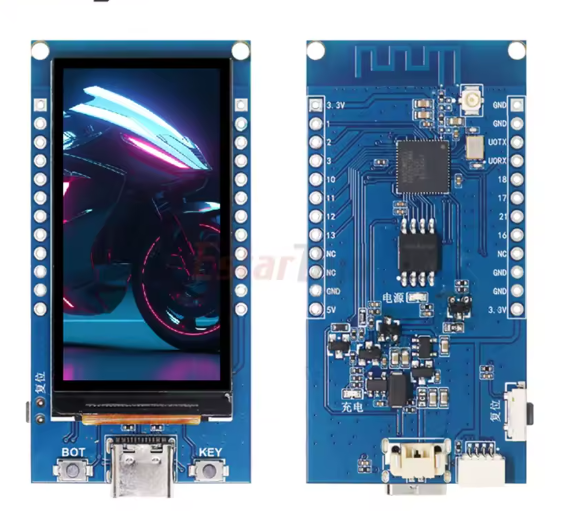

# SDR ESP32-S3

A Software Defined Radio receiver built on ESP32-S3 with a ST7789 320×170 display, featuring a real-time FFT spectrum analyzer and waterfall display.



---

## Features

- Real-time FFT spectrum analyzer (512 points, ~93 Hz/bin)
- Scrolling waterfall display with heat-map coloring
- MSI001 tuner covering HF bands (100 kHz – 30 MHz)
- NAU8822 audio codec for IQ capture via I2S
- Rotary encoder for frequency tuning and mode selection
- All demodulation modes: AM, FM, USB, LSB, CW
- PWM backlight control
- Dual-core FreeRTOS architecture (audio/FFT on Core 0, UI on Core 1)
- PSRAM framebuffer for smooth rendering

---

## Hardware

| Component | Description |
|---|---|
| ESP32-S3 | Main MCU, dual-core 240MHz |
| ST7789 | 320×170 SPI display |
| MSI001 | HF tuner / IQ demodulator |
| NAU8822 | Stereo audio codec (I2S + I2C) |
| Rotary encoder | Frequency tuning + mode select |

### Pin Mapping

#### ST7789 Display (SPI2)
| Display Pin | Signal | GPIO |
|---|---|---|
| 2 | RESET | 5 |
| 3 | SCL | 8 |
| 4 | DC | 7 |
| 5 | CS | 6 |
| 6 | SDA | 9 |
| 11 | BL (PWM) | 38 |

#### NAU8822 (I2S + I2C)
| Signal | GPIO |
|---|---|
| I2S BCLK | 17 |
| I2S WCLK | 18 |
| I2S DIN | 11 |
| I2S DOUT | 12 |
| I2C SDA | 21 |
| I2C SCL | 16 |

#### MSI001 (SPI2, shared with display)
| Signal | GPIO |
|---|---|
| CS | 10 |
| SCLK | 8 (shared) |
| MOSI | 9 (shared) |

#### Rotary Encoder
| Signal | GPIO |
|---|---|
| A | 1 |
| B | 2 |
| SW | 3 |

---

## Software Architecture

```
Core 0 (real-time)          Core 1 (UI)
─────────────────           ──────────────────
task_audio                  task_display
  └─ NAU8822 I2S              └─ ST7789 SPI
  └─ IQ samples               └─ FFT spectrum
       │                      └─ Waterfall
       ▼                           ▲
task_fft                    task_encoder
  └─ esp-dsp FFT 512pt        └─ Rotary encoder
  └─ Hann window              └─ Frequency tune
       │                      └─ Mode select
       └──── q_fft_result ────┘
```

---

## Project Structure

```
sdr_project/
├── CMakeLists.txt
├── sdkconfig.defaults
├── main/
│   ├── CMakeLists.txt
│   ├── idf_component.yml
│   ├── main.c          # App entry, FreeRTOS tasks
│   ├── sdr.h           # Pin definitions, types, global state
│   ├── display.c/h     # ST7789 driver, spectrum, waterfall
│   ├── fft.c/h         # FFT processing (esp-dsp)
│   ├── audio.c/h       # I2S + NAU8822
│   └── encoder.c/h     # Rotary encoder ISR
└── components/
    ├── msi001/         # MSI001 tuner driver
    ├── nau8822/        # NAU8822 codec (managed in audio.c)
    └── st7789/         # ST7789 placeholder
```

---

## Building

### Requirements

- ESP-IDF v6.0+
- VSCode + ESP-IDF extension

### Dependencies

The project uses `esp-dsp` via the IDF Component Manager. It is declared in `main/idf_component.yml` and downloaded automatically.

### Build & Flash

```bash
idf.py update-dependencies
idf.py build
idf.py flash monitor
```

### Simulated audio

For testing without RF hardware, enable the simulated IQ tone in `audio.c`:

```c
#define SIMULATE_AUDIO  1   // Set to 0 for real hardware
```

This generates a 5 kHz IQ tone visible as a peak in the spectrum and waterfall.

---

## Display Layout

```
┌─────────────────────────────────────┐
│  14.205.000 Hz   USB   S7   AGC ON  │  ← status bar (20px)
├─────────────────────────────────────┤
│                                     │
│         FFT Spectrum                │  (60px)
│                                     │
├─────────────────────────────────────┤
│                                     │
│         Waterfall                   │  (70px)
│                                     │
├─────────────────────────────────────┤
│    BW: 2.4kHz    VOL: ████   AGC   │  ← control bar (20px)
└─────────────────────────────────────┘
```

---

## License

MIT
